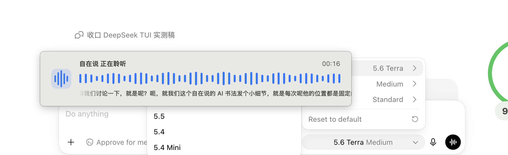
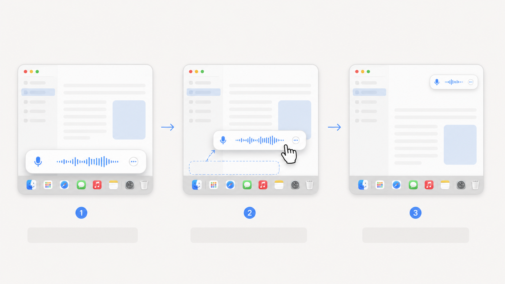
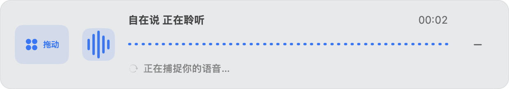
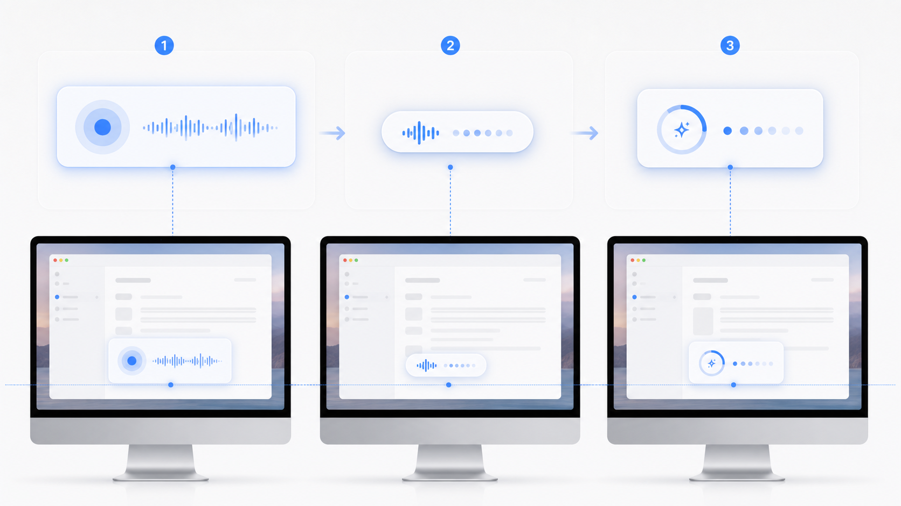

# 给 AI 语音输入法做了几处小优化，实际体验顺了不少——悬浮窗、拖动和位置记忆

这次 macOS v1.8.0 的升级，起因不是我突然想给界面换个样式，而是高频使用时遇到了一个很具体、也很影响操作的问题：

语音输入进行实时识别时，悬浮窗会遮挡当前应用底部的内容。最明显的一次，是我在 ChatGPT 里切换模型，模型选择菜单刚好从底部弹出来，却被语音输入条挡住了。

这是我在 ChatGPT 里切模型时截下来的画面。模型菜单刚好在底部弹出，自在说的语音输入条也固定在底部，于是两个东西正面撞上。

当时我就愤怒了！一个语音输入工具是来给我方便的，结果反过来阻断了输入前的正常操作。这件事让我萌生了一个很直接的想法：悬浮窗必须支持拖动，用户要能马上把它移到不挡内容的位置。

在这个想法上，这次升级又补了收起、贴边和位置记忆几个小功能。它们单独看都不大，但组合起来，日常使用会顺很多。

## 先从悬浮条的使用方式开始优化

这个问题出现以后，我花了不少时间想自动化方案：检测其他应用的菜单、根据菜单位置自动避让、甚至尝试让悬浮条自己寻找空白区域。

这些方案听起来都很聪明，但跨应用浮层并不知道另一个软件刚刚弹出了什么，也不能稳定判断那个位置是不是用户正在操作的地方。继续往自动化上堆，复杂度会越来越高，结果却未必可靠。

最后留下的反而是最简单、也最实用的方案：直接支持拖动。

挡住了，就把它拖开；暂时不需要完整信息，就收起来；想继续说话时，又能从波形和短文字里确认它还在工作。对于一个跨应用工具来说，把这个控制权交还给用户，比假装自己能读懂所有应用的界面更实际。

## 拖动这件事，还需要更容易发现和操作

最初的方案里，展开条左边有一个小点阵，当作拖动把手；收起后还有一个“贴边”按钮。

看起来功能都在。

实际一用，问题全出来了：拖动热区小，要精确点中；窗口拖起来会闪、跟手慢；贴边按钮也不容易理解——既然用户已经在拖，为什么还得再点一次，才能进入另一个模式？

这里我犯了一个很典型的产品错误：把“功能存在”当成“用户能自然发现并用好”。

后来我把拖动改成了 macOS 原生窗口拖拽。鼠标移到把手上，点阵会有蓝色背景和“拖动”提示；把手热区也扩大了。收起按钮用同一套反馈：平时只显示减号，鼠标移入才出现蓝色背景和“收起”。

这个变化看起来很小，但它解决了一个很实际的问题：用户不需要先猜哪个图标可以拖，也不用精确点中一个很小的区域。鼠标移过去，界面会先告诉你“这里可以动”。

文字不需要一直占着空间，但在用户需要理解动作时，必须出现。

贴边也不再是单独按钮。只有用户明确向屏幕外侧拖动一段距离后松手，窗口才会变成贴边球；普通拖动只是移动位置。这样能避免停在屏幕边缘时被误判为“要收起”。

## 收起以后，至少要看得出它还在工作

收起以后，如果只剩一个球和几根波形，确实很干净，但用户看不出刚才说的话有没有被识别；但如果把完整文字都放进去，又会重新挡住屏幕，和收起的目的冲突。

所以现在的收起状态只保留三样东西：动态波形、录音时间，以及最近一小段文字。文字只显示最新内容，不把整段转写塞进小窗口；屏幕共享时，也可以在设置里关掉这段实时文字。

视觉上，我也没有继续把它做成一条单薄的线，而是逐步调整成更清楚的卡片化表达：波形、状态文字、时间和操作入口各自有位置，用户能一眼看懂“正在听什么、现在是什么状态、下一步可以做什么”。

这不是为了让动画更炫，而是为了在“看得见它在工作”和“它别碍着我”之间找一个能长期使用的平衡。

## 位置记忆是这次补上的一个细节

拖动做顺了，我以为位置记忆就是顺手的小功能。

结果第一版只记住了“靠左还是靠右”。你上次把悬浮条拖到某个位置，下次它可能跑到右侧中间。它记住的是一个停靠规则，却没有记住用户真正放下的位置。

更麻烦的是，录音时是长条，停止后会切到“正在处理”，收起又是胶囊。它们尺寸不同，如果每个状态都重新算位置，就会看起来像三个窗口在屏幕上跳来跳去。

现在的规则很简单：

- 第一次使用，默认底部居中；
- 主动拖放后，记录窗口中心相对屏幕的位置；
- 展开、收起和处理提示都围绕同一个中心改变尺寸；
- 窗口隐藏前再保存一次，下次快捷键唤起时恢复最后的位置和形态。

这听起来像小细节，但对高频工具来说，它其实是在回答一个很朴素的问题：你把东西放在哪里，它下次还认不认识那个位置？

## 这次先更新 macOS

这次已经发布 macOS v1.8.0，提供 DMG、ZIP 和 SHA256 校验文件。

Windows 暂时保持在 1.7.0。最近家里有些事情，Windows 电脑也拆开维修了，暂时没有条件做完整的真实验证，所以这次只更新 Mac。

等 Windows 设备恢复后，再补那边的测试和发布。

我现在对这版的结论是：它不是把语音输入“做得更显眼”，而是让它在需要出现时足够清楚，在不该打扰时能收得住。

真正高频的工具，最后比的往往不是功能有多少，而是它会不会在你最顺手的时候，突然变成那个碍事的东西。
