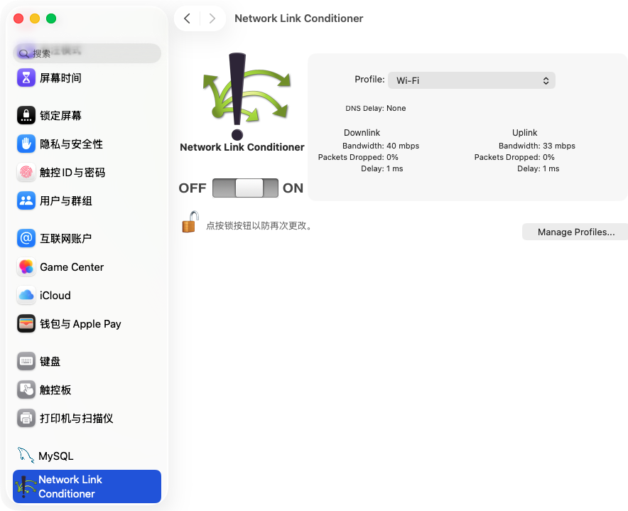

# AI 语音输入法弱网体验：文章素材包

> 状态：素材收集中，尚未进入正式成稿。
>
> 核心原则：只写已经验证的现象与已经上线的改动；录音文件兜底、本地 ASR 等仍属于后续方案，不能写成现有能力。

## 一、主题判断

这篇文章真正值得写的不是“网络不好，所以识别慢”这一句常识，而是一个容易被忽略的产品错觉：

**声波在动，只能证明麦克风采集到了声音，不代表云端已经收到、理解并返回了文字。**

用户看到声波持续跳动，会自然认为系统仍在工作。如果十几秒没有文字，也没有状态解释，他不知道应该继续说、重新录，还是直接放弃。这是语音输入法在弱网下最伤信任的时刻。

文章可以围绕三个问题展开：

1. 为什么“有声波、没文字”比直接报错更让人焦虑？
2. 最低改动下，如何先做到不误导、不乱序、可取消？
3. 为什么真正的“不丢内容”还需要录音文件或本地识别兜底？

## 二、真实问题现场

### 现场一：录音 8 秒，声波正常，文字区为空

- 麦克风采集链路正常。
- 实时模型尚未返回可展示的文字。
- 用户只能看到“正在捕捉你的语音”，无法判断是网络慢、服务端慢还是识别失败。
- 原始截图待重新补入：早期系统临时文件已经过期。

### 现场二：录音约 20 秒，文字开始断续出现

- 证明内容不是完全无法识别，而是实时链路出现了明显积压或延迟。
- 文字晚到时，用户已经开始怀疑前面说的内容是否丢失。
- 原始截图待重新补入：早期系统临时文件已经过期。

### 现场三：用 Network Link Conditioner 复现弱网

截图说明：在 macOS 系统设置中安装 Network Link Conditioner 后，可以选择网络配置并统一开关。截图中仍为 `Wi-Fi` 配置且处于 `OFF`，尚未施加弱网条件。

实测配置：选择 `Very Bad Network`，上下行均为 1 Mbps、双向丢包率 10%、上下行延迟各 500 ms。它模拟的是高延迟、高丢包但没有完全断网的状态。

### 现场四：弱网提示与恢复实测成功

第 7 秒时声波仍在活动、文字尚未返回，界面已经显示定稿提示：“当前网络环境差，可能会花超出平时的更多时间，请耐心等待。”这验证了“采集继续、解释等待、不强制打断”的降级体验。

第 26 秒时实时文字开始返回，弱网提示自动消失，录音会话保持进行中。该截图验证了实时链路可以从长延迟状态恢复；仅凭截图不能证明最终文本完整性，仍需在停止录音后与原话逐句比对。

Apple 官方说明，Network Link Conditioner 可以模拟低带宽、高延迟、DNS 延迟和丢包等条件；Apple 还建议把延迟提高到 3～4 秒，检查用户操作是否只是慢几秒，而不是拖成几分钟。

## 三、当前已经完成的产品改动

### 1. 豆包音频帧改为 FIFO 串行发送

弱网会放大并发发送带来的协议时序风险。当前实现把豆包 WebSocket 的音频帧和结束帧放进同一个队列，严格按顺序发送，结束帧永远排在全部音频之后。

这里要避免一个错误表述：**不是说 WebSocket 会随意打乱消息。** RFC 6455 要求消息分片按顺序交付。我们解决的是客户端并发调用发送接口时，应用层无法稳定保证“音频序号与实际发送顺序一致”的问题。串行队列把这个顺序显式固定下来。

### 2. 五秒无首字时给出弱网提示

触发条件：已经采集到足够的有效语音，但录音开始 5 秒后仍没有任何模型文字。

当前定稿文案：

> 当前网络环境差，可能会花超出平时的更多时间，请耐心等待。

产品判断：不说“抱歉”，不让用户重新说，也不假装系统已经失败；只解释等待时间可能变长。

### 3. 增加“取消本次输入”

- 录音悬浮条的展开、紧凑和贴边形态都提供低干扰的 `×`。
- 点击后立即停止麦克风、断开实时连接。
- 不写入宿主输入框，不新增历史记录。
- 取消后晚到的最终文字和错误回调会被忽略。
- 没有绑定 Esc，避免把按键传给微信、浏览器等宿主软件。

### 4. 当前能力边界

- 目前没有把完整录音落盘后自动提交给非实时模型。
- 目前没有启用 macOS 或 Windows 本地语音识别作为弱网兜底。
- 当前弱网提示主要覆盖“开始录音后一直没有首字”的情况；如果已经出过文字，随后网络才恶化，同一会话不会再次触发这条五秒提示。
- FIFO 修复当前针对豆包实时客户端；提示和取消能力不局限于豆包。

## 四、可核对的外部事实

### 事实 1：弱网不只是“断网”

Apple 把低带宽、高延迟、DNS 延迟和丢包都列为需要模拟的网络条件。关闭 Wi-Fi 只能验证完全断线，无法替代弱网测试。

### 事实 2：实时与非实时识别是两条不同调用链

阿里云百炼的官方选型文档明确区分：

- 实时识别使用 WebSocket，音频流式输入、文字流式输出；例如 `fun-asr-realtime`。
- 非实时文件转写使用 HTTP；例如 `fun-asr`。

因此，“实时模型弱网后直接切同名非实时模型”在产品概念上成立，但工程上不是切一个模型名：还涉及完整音频保存、文件格式、上传、任务查询、幂等输出与隐私清理。

### 事实 3：豆包同时提供流式和录音文件识别

火山引擎官方产品页同时列出大模型流式语音识别和大模型录音文件识别。录音文件极速版支持一次请求返回结果，官方接口约束包括音频不超过 2 小时、不超过 100 MB，支持 WAV、MP3、OGG OPUS；上传二进制流建议尽量控制在 20 MB 以内。

这说明文件识别可以作为后续完整性兜底，但仍然要先定义录音时长、文件大小、失败重试和敏感音频删除策略。

## 五、三个文章开头方向

### Hook A：痛点现场

> 声波已经跳了 8 秒，一个字都没有。你不知道它是在认真听，还是早就什么都没收到。又过了十几秒，文字像堵车一样，一小段一小段地冒出来。

适合：用真实截图开篇，最贴近用户感受。

### Hook B：反常识

> 语音输入框里最会骗人的东西，可能就是那条一直在动的声波。它只能证明麦克风有声音，证明不了云端真的听见了。

适合：标题和开头冲击力更强，容易引出端到端链路。

### Hook C：产品取舍

> 弱网时最简单的方案，是弹一句“网络异常，请重试”。但对语音输入法来说，这句话等于告诉用户：刚才那段话，请你再说一遍。

适合：突出为什么没有使用常见错误弹窗，以及“最低改动”背后的判断。

## 六、增强版文章大纲

### 1. 一条会动的声波，为什么没有带来安全感

- 放入 8 秒无文字截图。
- 放入 20 秒后断续出字截图。
- 描述用户不知道该继续、停止还是重说的尴尬。

### 2. 我先拆开了“语音输入”这条链路

- 麦克风采集。
- 本地 PCM 处理与语音门控。
- WebSocket 上传。
- 服务端识别。
- 增量文字返回。
- 最终文字写入宿主输入框。

重点：声波只覆盖最前面一小段链路。

### 3. 第一反应是换非实时模型，但这不是改一个模型名

- 豆包与阿里都存在实时和文件识别能力。
- 文件兜底需要保存完整音频。
- 需要处理上传、时长限制、崩溃恢复、重复写入、隐私删除。
- 解释为什么首版不直接大改。

### 4. 这次先做三个最低改动

- 豆包发送队列串行化。
- 五秒无首字的持续提示。
- 录音中的 `×` 取消入口。

### 5. 我是怎么把弱网“造出来”的

- 展示 Network Link Conditioner 截图。
- 使用 `Very Bad Network` 或自定义高延迟配置。
- 测试有声波无文字、恢复后追字、录音中取消三个场景。
- 测试结束关闭系统级弱网开关。

### 6. 这还不是“不丢内容”的终点

- 当前只是更可解释、更稳定、可退出。
- 下一阶段才是完整录音 + 文件 ASR。
- 本地识别可以作为草稿或离线能力，但 macOS 与 Windows 能力差异需要单独评估。

### 7. 结尾落点

语音输入法真正需要保护的，不只是识别准确率，而是用户刚刚组织好的那段表达。网络慢一点可以接受，让用户不知道内容还在不在，才是最伤信任的体验。

## 七、测试素材清单

- [x] Network Link Conditioner 安装完成截图。
- [ ] 8 秒有声波无文字截图，请重新补原图。
- [ ] 20 秒后断续出字截图，请重新补原图。
- [x] `Very Bad Network` 已开启截图。
- [x] 新弱网提示实机截图（第 7 秒出现）。
- [x] 弱网下文字恢复截图（第 26 秒开始出字）。
- [ ] 展开态取消按钮截图。
- [ ] 点击取消后宿主输入框未变化的前后对比。
- [ ] 网络恢复后文字追上的屏幕录像或连续截图。

## 八、来源

1. Apple：Network Link Conditioner 可用于模拟不同网络条件，并包含在 Additional Tools for Xcode 中：<https://developer.apple.com/library/archive/documentation/AudioVideo/Conceptual/MediaPlaybackGuide/Contents/Resources/en.lproj/HTTPLiveStreaming/HTTPLiveStreaming.html>
2. Apple：真实网络测试应覆盖低带宽、高延迟、DNS 延迟和丢包：<https://developer.apple.com/library/archive/documentation/NetworkingInternetWeb/Conceptual/NetworkingOverview/WhyNetworkingIsHard/WhyNetworkingIsHard.html>
3. Apple WWDC：macOS 可用 Network Link Conditioner 构造可重复的弱网配置：<https://developer.apple.com/videos/play/wwdc2019/422/>
4. IETF RFC 6455：WebSocket 消息分片必须按顺序交付：<https://www.ietf.org/rfc/rfc6455.html>
5. 阿里云百炼：实时 WebSocket 与非实时 HTTP 模型选型：<https://help.aliyun.com/zh/model-studio/asr-model/>
6. 阿里云百炼：非实时录音文件识别：<https://help.aliyun.com/zh/model-studio/non-realtime-speech-recognition-user-guide>
7. 火山引擎：豆包语音识别产品能力：<https://www.volcengine.com/product/asr>
8. 火山引擎：大模型录音文件极速版识别 API：<https://www.volcengine.com/docs/6561/1631584>
