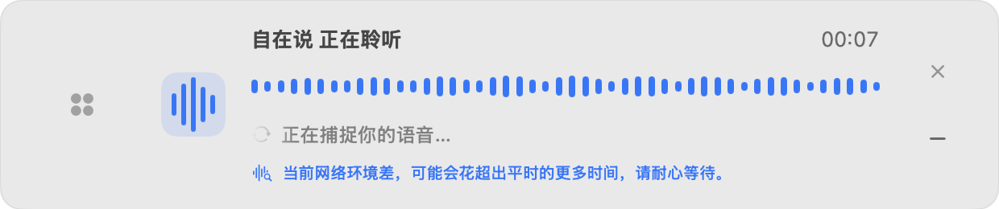
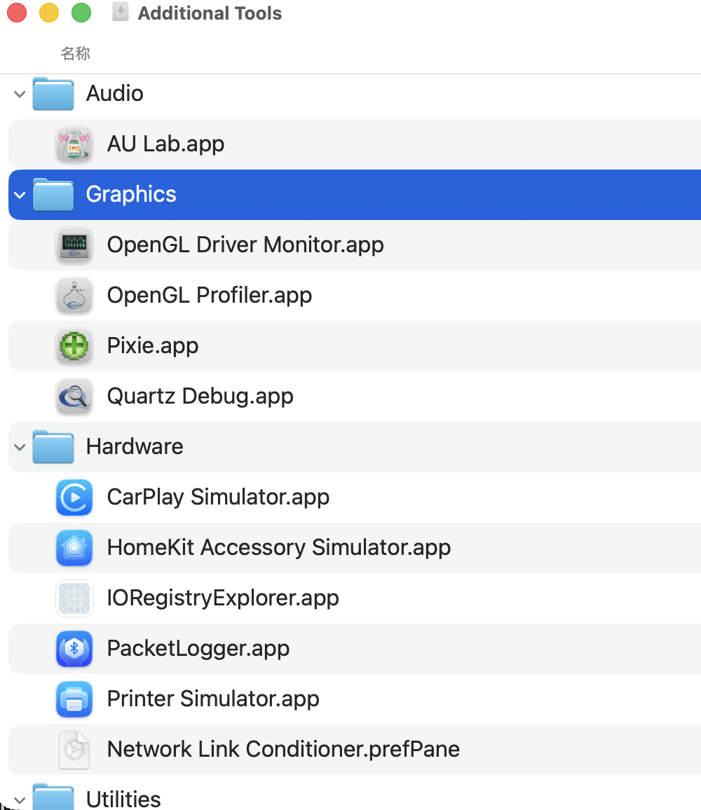
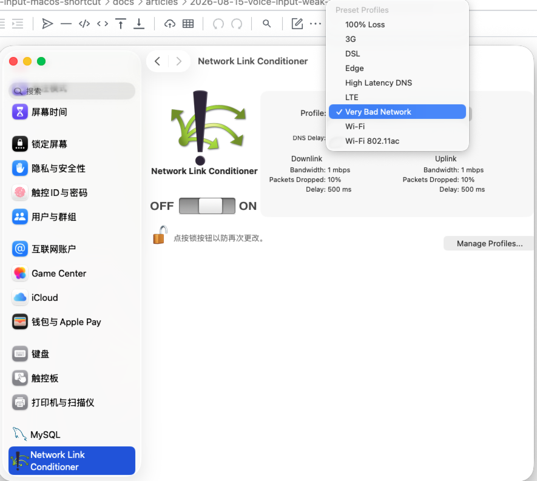

# 这几天断网后，我给 AI 语音输入法补了个弱网提示

这几天家里断网，只能拿手机热点上网。

平时感觉还行。开网页、回消息，基本没什么问题。直到我开始用自己的 AI 语音输入法。

声波还在跳，说明麦克风收到了声音，但页面不出字。有时等十几秒，文字才一点一点回来；网络再差一点，识别连接就断了。

这才发现，之前测得最多的是正常 Wi-Fi。弱网这个场景，其实没有认真覆盖过。

## 先评估了一下：这个场景可以轻量解决

第一个念头，是不是该把录音存下来，实时识别慢了就自动切到非实时模型。

阿里和豆包都有这类能力，方向没问题。但为了一个小概率的弱网场景，直接加一整套文件识别并不轻：要保存完整录音、上传、处理重试、避免实时结果和文件结果重复写进输入框，还要处理敏感音频的删除。

这次评估下来，先把体验补齐更合适。用户最难受的不是慢几秒，而是不知道语音输入法到底还在不在工作。

这次没有做大兜底，但把弱网和断网分开处理了。

第一个：已经持续收到语音、但一段时间没有文字返回时，显示一句提示：

> 当前网络环境差，可能会花超出平时的更多时间，请耐心等待。

文字重新返回后，提示会自动消失。

如果是完全断网，就不该让用户继续等了。识别框会明确提示：

> 检测到断网，请连接网络后再使用。

它会停留几秒，也可以手动关闭，不再像原来一样闪一下就消失。

第二个：不管网络好坏，音频上传都按录音顺序排队。

这里说得直白一点：录音不是攒成一整个文件再发出去，而是不断切成很短的音频片段上传。现在这些片段始终按录制顺序排队，前一段发完，下一段再发。正常网络下这只是把链路收紧；网络一差时，它能避免客户端自己的并发发送再增加不确定性。

这不是说 WebSocket 会在网络差时把消息打乱。问题出在应用内部如何安排一段段音频的发送。

## 测试时，我顺手找到了 Mac 自带的弱网工具

要测这个改动，不能只靠“等家里再断一次网”。

我原先习惯用 Chrome 开发者工具模拟网络条件，突然想到：Mac 上会不会也有类似的东西？一查还真有，苹果就在 Xcode 的 Additional Tools 里附带了 **Network Link Conditioner**。

安装后，它会出现在 macOS 的系统设置里。可以直接选预设，也能自己设置带宽、延迟和丢包率。

这次我选的是 `Very Bad Network`：

- 上下行带宽都是 1 Mbps
- 上下行丢包率都是 10%
- 上下行延迟各 500 ms

它不是断网，而是把网络变成高延迟、有丢包的状态。拿来测“能连上、但慢得很难受”的场景正好。

## 跑一遍，结果和预期一致

打开弱网后录音。

第 7 秒，声波还在动，文字还没返回，但上面这条弱网提示已经出现。

继续等待，到第 26 秒左右，识别文字开始陆续返回，提示自动消失：

我也把网络彻底断开试了一次。这个状态和弱网不一样：弱网还有机会等到结果，完全断网则直接结束本次识别，并给出上面的连接网络提示。

这次没做什么大功能。只是把“继续等”和“先别录了”分清楚，再把客户端的发送顺序收紧一点。网络慢时，用户不会只看到声波在动；没网时，也不会看着识别框一闪而过。

## 写在最后

这个功能不在我最开始的产品规划里。

一开始想的是识别准不准、快捷键顺不顺、文字能不能准确写进输入框。真正用了几天，恰好遇到断网和手机热点，才知道还有“声波在动但不出字”这个坑。

很多功能就是这么来的。规划能覆盖常见流程，真实使用才会把边角问题撞出来。

AI 对我来说，价值不只是能更快写代码。它让“发现一个实际痛点 → 找到可验证的改法 → 做一个小改动 → 用工具复现测试”这件事，成本低了很多。

当然，AI 不会替你发现问题，也不会替你判断该不该大改。先多用，问题才会出现；出现以后，再把它尽快解决掉。

---

测试工具：Network Link Conditioner，随 Xcode 的 Additional Tools 提供。测试完成后记得关掉系统级弱网开关，不然别的软件也会一起变慢。
